# AREP-MATH-SERVICE
### Creamos el scaffolding basico con ayuda de spring initlzr
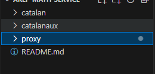

### Copiamos el codigo base de httpConnection y lo modificamos para que reciba una URL como parametro y ejecute la funcion
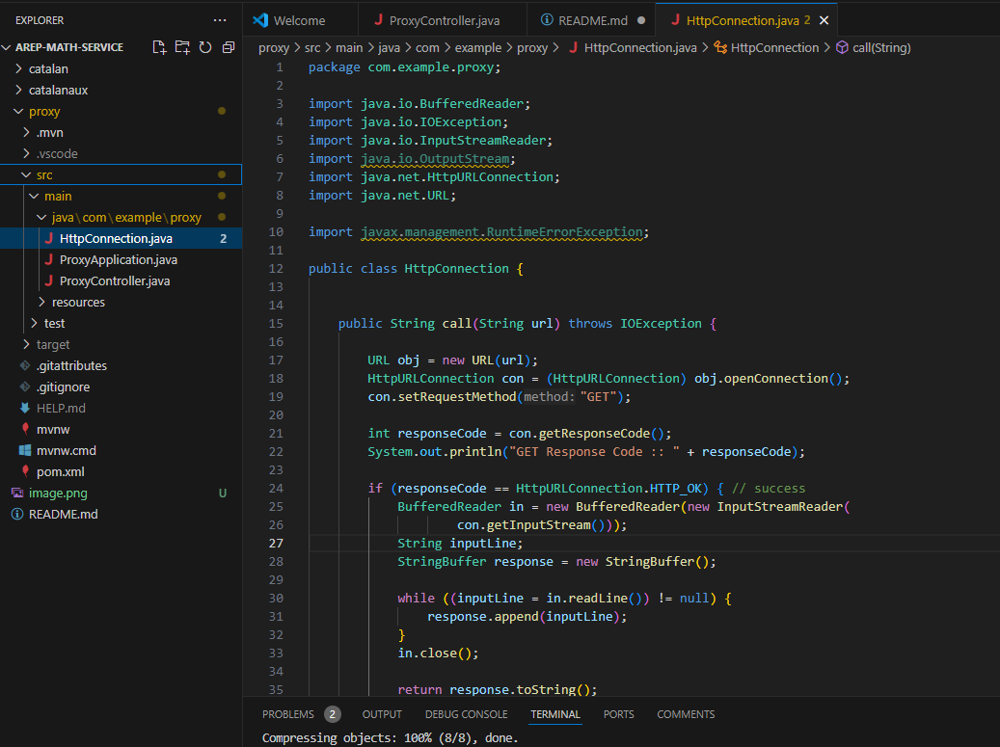

### Creamos el controlador basico de proxy con la configuración de que si falla una instancia ejecute la otra (sin links de instancias ya que todavia no estan creadas)
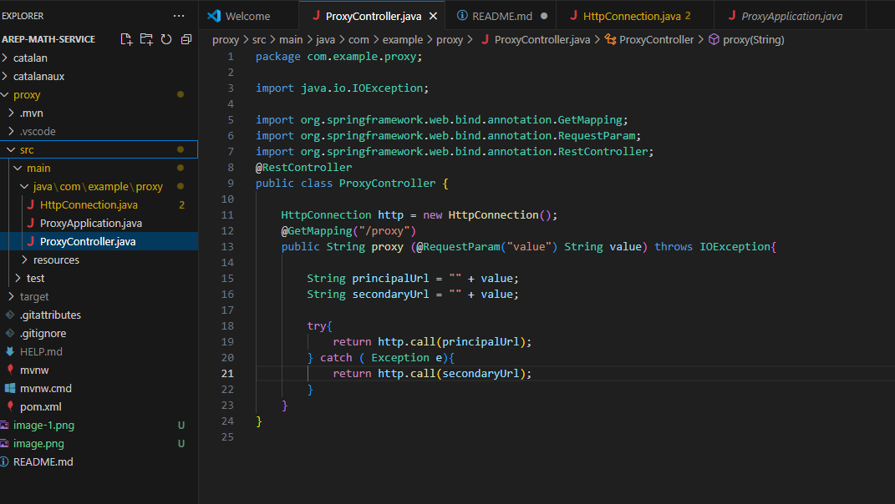

### Creamos la logica principal del problema propuesto de catalan 
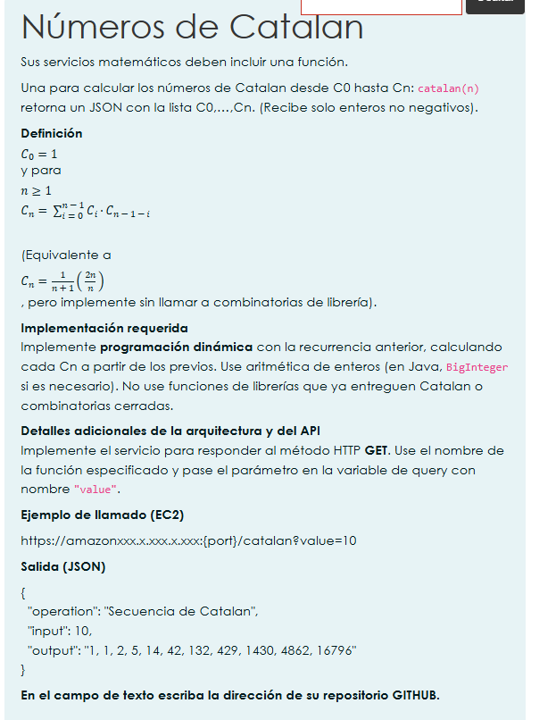
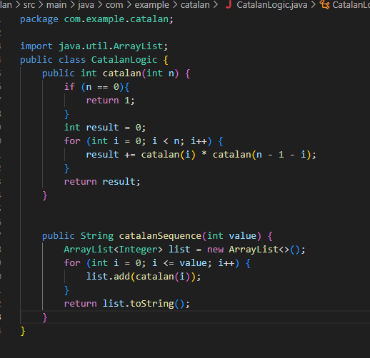

### Creamos el controlador para usar la logica de la clase creada de catalan 
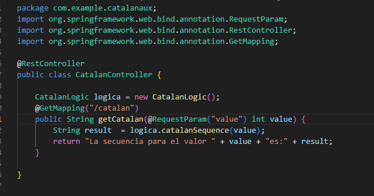

### Copiamos y pegamos las clases en el catalanAux que va ser nuestro segundo servidor 
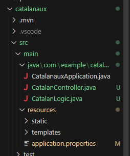

### Configuramos los puertos de los dos servidores en el application.properties para que uno abra en el puerto 8081, otro en el 8082 y el proxy en el 8080
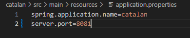
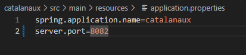

## Probamos algun servicio para ver que funcione bien con el caso de prueba del enunciado 
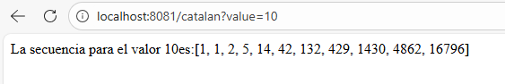

### Creamos las dos instancias en aws 
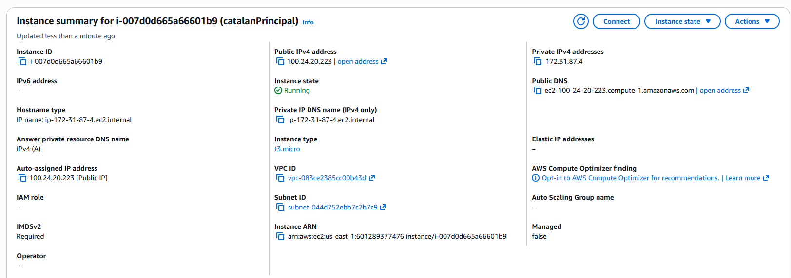
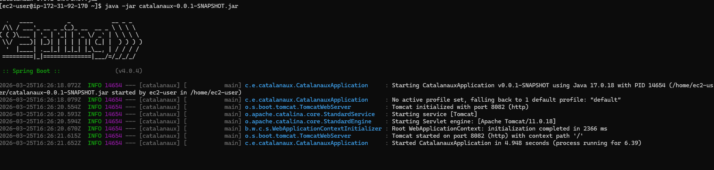

### Miramos el proyecto compilado de catalan y buscamos el target el .jar
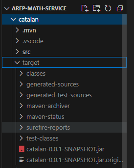

### Nos conectamos a la instancia , en este caso sera la primera catalanPrincipal pero se repite el mismo proceso con la intancia catalanSecundary

### Mediante sftp subimos el .jar compilado del target a la instancia 
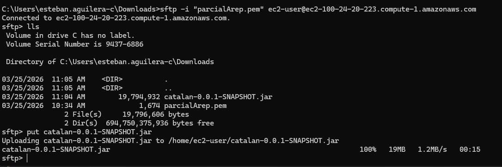

### Ahora, nos conectamos con ssh e instalamos java. Para eso miramos la documentacion dada por el profesor y lo instalamos 
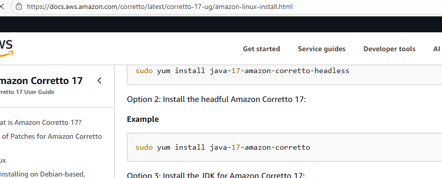
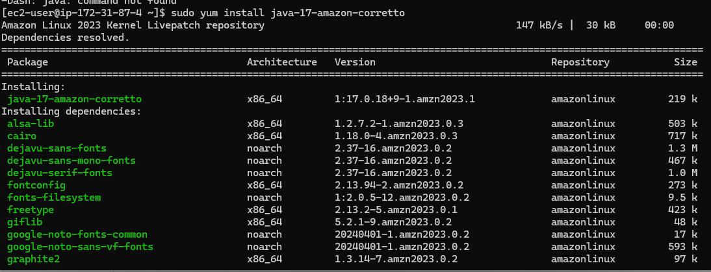

### Corremos el jar que subimos anteriormente con sftp
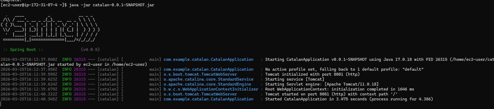

### El servidor ya esta corriendo y la instancia tambien, pero falta permitir el puerto 8081 en las security inbounds ya que por ahi esta corriendo el jar
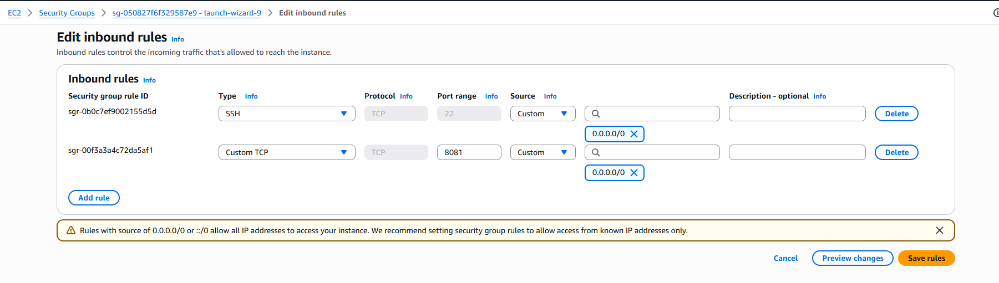

### Ahora probamos que el endpoint este funcionando en la instancia:
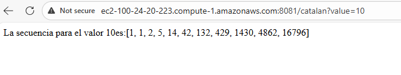

### Repetimos los mismos pasos pero para la instancia 2 (subir jar, instalar java, compilar, habilitar puerto 8082)
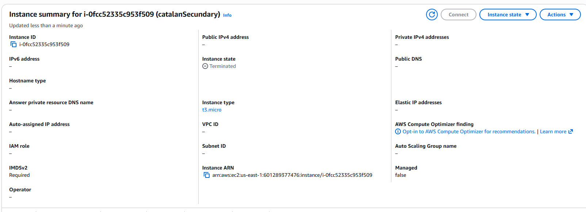

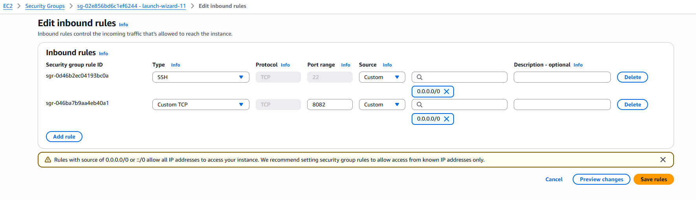
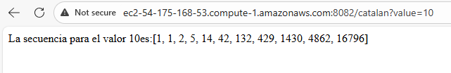

### Una vez las dos instancias funcionando y corriendo, ahora configuramos los links en el proxy controller 
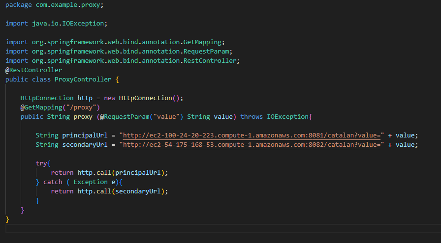

### Configuramos el index html en base al dado por el profesor, cambiamos endpoints y valores de acuerdo a nuestro proxy Controller
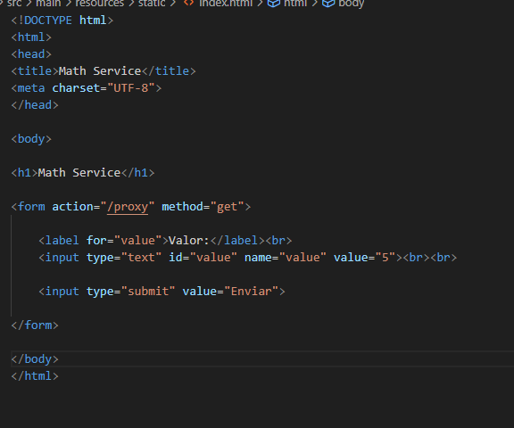

### Corremos el back y miramos que funcione y redirija a la instancia configurada 
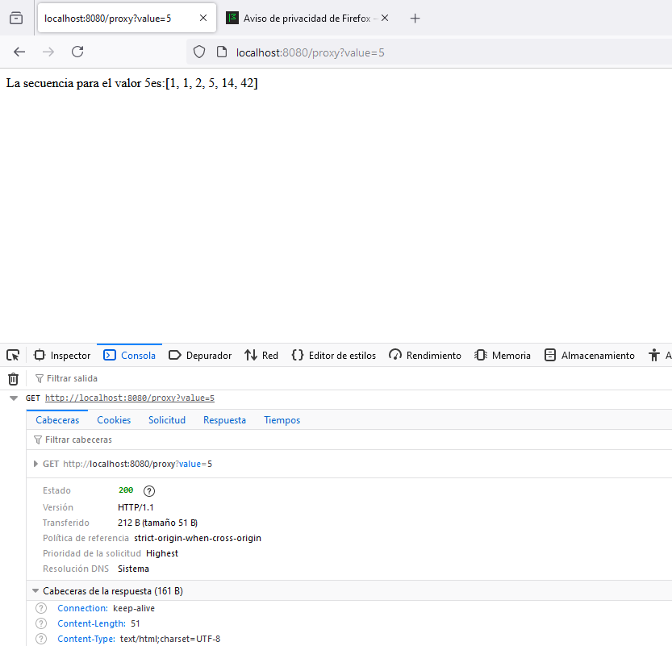

### Una vez funcionando, entonces repetimos el mismo proceso que hicimos con las otras dos instancias. Crear instancia, conectarse, subir el jar, instalar java, correr el jar, configurar security inbounds ( en este caso 8080 (proxy), 8081(catalan1), 8082(catalan2) ) y probar la url del ec2 para ver que todo funciona correctamente
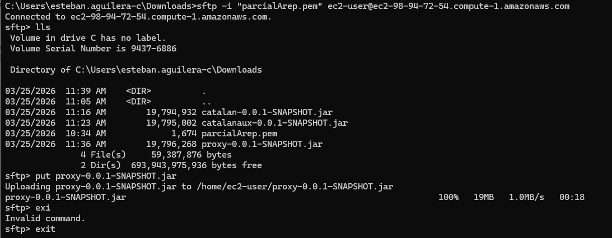
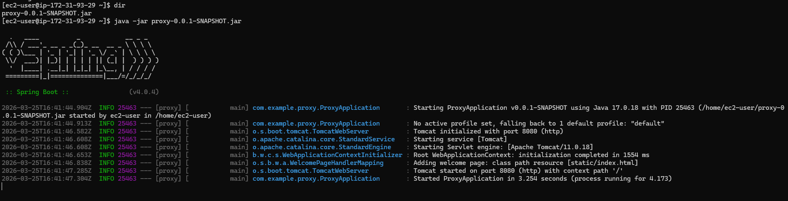
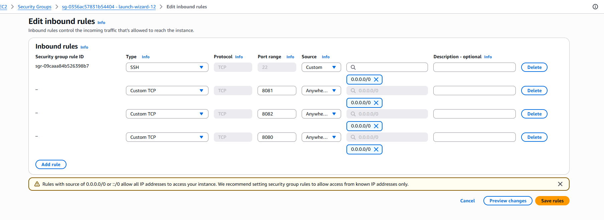
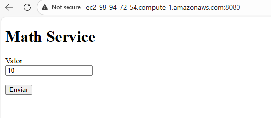
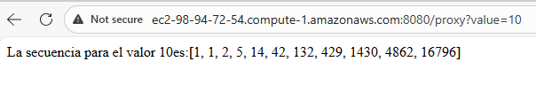

